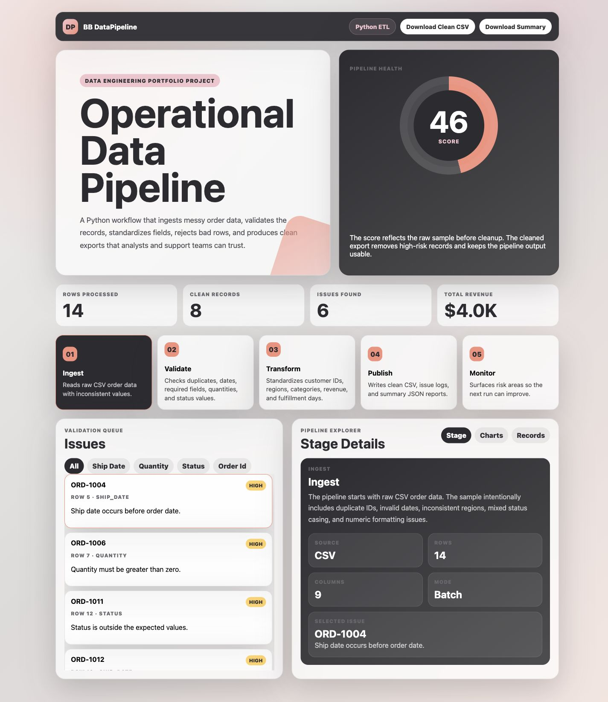

# BB DataPipeline

BB DataPipeline is a Python ETL project that turns messy operational order data into cleaned records, validation findings, and recruiter-friendly summary reports.

It is built to show the kind of work behind data engineering: ingesting raw files, validating data quality, transforming fields, creating exports, and explaining what changed along the way.

## Live Demo

[Open the interactive GitHub Pages demo](https://briannab1997.github.io/BB-DataPipeline/)

The demo lets you preview a pipeline run, filter validation issues, inspect transformed records, and download sample outputs directly in the browser.



## What It Does

- Ingests raw CSV order data
- Validates required fields, dates, status values, quantities, prices, regions, and duplicate order IDs
- Standardizes inconsistent values like region names and status labels
- Calculates revenue, fulfillment timing, customer segments, and pipeline health metrics
- Exports cleaned CSV, issue logs, and a JSON summary report
- Includes unit tests for the core pipeline logic

## Why I Built It

I wanted a project that shows practical Python and data workflow skills beyond a static dashboard. This project focuses on the kind of data cleanup and reporting work that supports analytics, operations, product support, and cloud/data engineering teams.

## Tech Stack

- Python
- CSV/JSON processing
- HTML
- CSS
- JavaScript
- GitHub Pages

## Run Locally

```bash
python3 -m unittest discover -s tests
python3 -m bb_datapipeline --input data/raw_orders.csv --out reports
```

After running the pipeline, check the `reports` folder for:

- `clean_orders.csv`
- `pipeline_issues.csv`
- `pipeline_summary.json`

## Project Structure

```text
.
├── bb_datapipeline/
│   ├── __init__.py
│   ├── __main__.py
│   └── pipeline.py
├── data/
│   └── raw_orders.csv
├── reports/
│   ├── clean_orders.csv
│   ├── pipeline_issues.csv
│   └── pipeline_summary.json
├── tests/
│   └── test_pipeline.py
├── assets/
│   └── datapipeline-dashboard.png
└── index.html
```

## Portfolio Notes

This project is a good fit for data analyst, data engineer, cloud support, product support, and software roles because it shows hands-on work with messy data, validation logic, transformation rules, and clear reporting.
